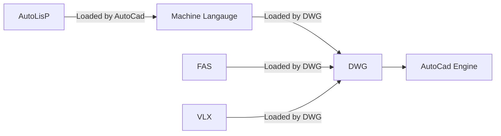

## AutoCAD Malwares

AutoCAD is Engineering Drawing program (2D,3D) that used by almost any engineering company, so it's target for many attackers to exploit some functions in it

the main file in AutoCAD is DWG "drawing" file which contains the actual drawing of the file 


### How Attackers Exploit AutoCAD functions

- dwg file supports **VBA** to build macros to help engineers  automating some of there tasks, so Hackers used this functionality to attack the system 
- dwg loads **lsp files** which contains AutoLISP code, and it's **code** so it could be used in a malicious way
- dwg loads **FAS files** which is compiled version of lsp, so attackers prefer it because it's not straight forward to malware analyst, the analyst has to decompile it first and there are few decompilers  
- dwg loads **VLX files** which another format of compiled lsp files, and it has the same decompiling issue as FAS files, but more over it supports VBA, so it could be Dual attack




#### DWG Files

Just write a macro in the dwg file. since AutoCAD 2012, a warning message is displayed to the user if dwg would run a macro

#### LSP Files


lsp files which is written in AutoLISP could be loaded from the dwg file if it resides in the same directory  

*sample of lsp code is located in the Misc folder*

#### FAS files

FAS is compiled file from Auto LISP 

to compile lsp files

```powershell
vlisp-compile 'st "file.lsp" "acad.fas"
```

**How to Attack**

- Write malicious code in lsp file then compile it using vlisp-compile and generate the FAS file, if the FAS  located in the same path of the dwg file, it will run once the dwg file is open
- moreover write lsp code in away that copy it self in the main directories that AutoCAD loads the fas files from, so it opens with any project

**How to Analysis**

Decompiling FAS file requires FAS decompiler which could be found 

[FAS Deompiler V 0.9](https://files.planet-dl.org/cw2k/Fas%20AutoLisp-Decompiler/fas-interpreter-beta-09.7z) *"in Misc folder"*

[FAS Decompiler Old Versiobn](https://github.com/Hopfengetraenk/Fas-Disasm) *"in Misc folder"*

[Tools to Decompile VLX](https://lispbox.wordpress.com/2014/12/23/visual-lisp-vlxfas-and-visual-basic-v5v6-files-decompiling-procedure/) "Not Tested yet"

to run it requires two OCX files  *"in Misc folder"*

```powershell
Copy-Item comdlg32.ocx C:\Windows\SysWOW64\.
Copy-Item MSCOMCTL32.OCX C:\Windows\SysWOW64\.
regsvr32.exe C:\Windows\SysWOW64\comdlg32.ocx
regsvr32.exe C:\Windows\SysWOW64\MSCOMCTL32.OCX
```

then open the FAS disassembler and drop the FAS file, the lsp file will be generated in the same directory contains the FAS file

#### VLX files

VLX is a compiled version of lsp files, it can contains VBA,DCL" Contains definitions of AutoCAD Dialog Boxes " and text

it could be decompiled also using FAS decompiler V 0.9


### Protection

>  Starting with AutoCAD 2014 there are security variables (TRUSTEDPATHS, SECURELOAD, etc.) in place that [control](https://knowledge.autodesk.com/support/autocad/learn-explore/caas/CloudHelp/cloudhelp/2018/ENU/AutoCAD-Core/files/GUID-C108E81C-7A06-477C-A5F8-10AA2FDEB050-htm.html) what executable files (modules) can be loaded automatically, from what location, and whether to display a pop-up warning, similar to Microsoft Word's macro settings. 
>
> -- Force Point


### Detection

- sysmon
  - File created
    - .fas .vlx .lsp files
  - Network Connection
    - from Autodesk image

```xml
<FileCreate onmatch="include">
			<TargetFilename condition="contains">.fas</TargetFilename> 
			<TargetFilename condition="contains">.vlx</TargetFilename>  
			<TargetFilename condition="contains">.lsp</TargetFilename> 
		</FileCreate>
<NetworkConnect onmatch="include">
	<Image condition="contains">autodesk</Image>
</NetworkConnect>
```


### Reference

1- [FAS vs VLX and how to compile FAS](https://www.afralisp.net/visual-lisp/tutorials/compiling-part-1.php)

2- [FAS analysis force point](https://www.forcepoint.com/ko/blog/security-labs/autocad-malware-computer-aided-theft)


