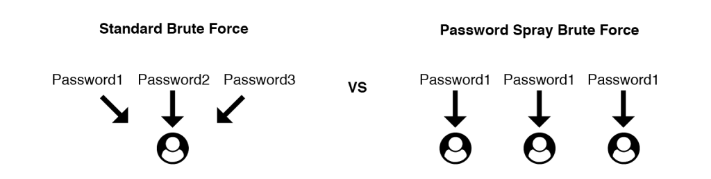
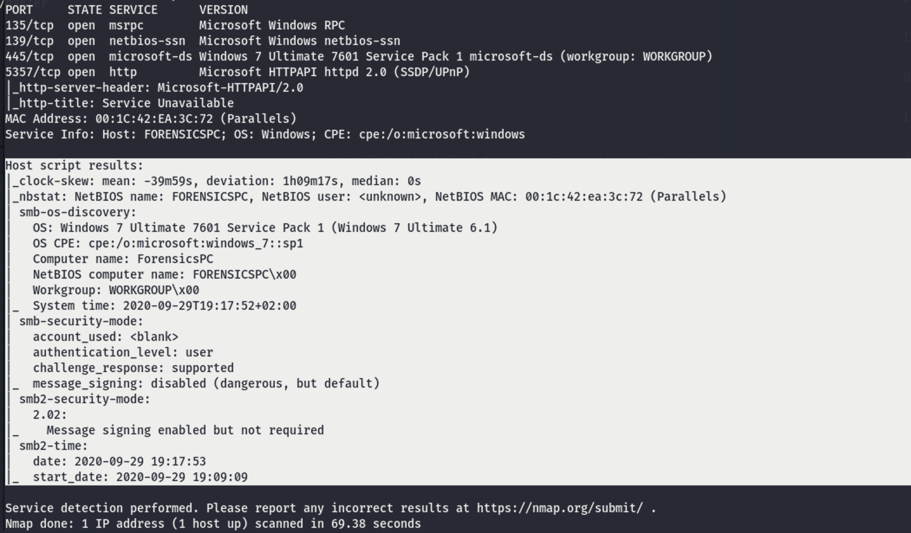
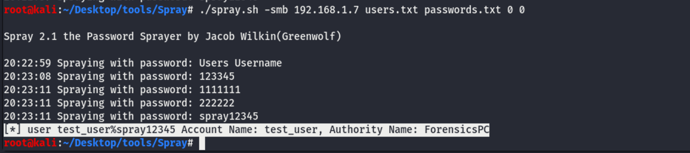
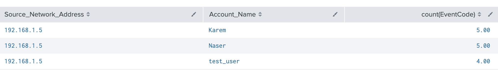

# Password Spray Attack

## Summery:

> Adversaries may use a single or small list of commonly used passwords against many different accounts to attempt to acquire valid account credentials. Password spraying uses one password (e.g. 'Password01'), or a small list of commonly used passwords, that may match the complexity policy of the domain. Logins are attempted with that password against many different accounts on a network to avoid account lockouts that would normally occur when brute forcing a single account with many passwords.

Password Spraying could be used against a lot of services like:

- SSH (22/TCP)
- Telnet (23/TCP)
- FTP (21/TCP)
- NetBIOS / SMB / Samba (139/TCP & 445/TCP)
- LDAP (389/TCP)
- Kerberos (88/TCP)
- RDP / Terminal Services (3389/TCP)
- HTTP/HTTP Management Services (80/TCP & 443/TCP)
- MSSQL (1433/TCP)
- Oracle (1521/TCP)
- MySQL (3306/TCP)
- VNC (5900/TCP)


Spraying VS Brute-Force:

- Brute-Force: Attacker targets one user or list of users. But with one user per full list of passwords, when list of passwords finished, shift to the next user.
- Spray: Attacker targets list of users. But one password per list of users, When users finished, shift to the next password.



## Attack Scenario:

We will target a local windows machine that has a SMB service enabled (file shared), From kali machine using a spraying tool called [Spray](https://github.com/Greenwolf/Spray).

##### Discovery

```bash
$ nmap -sC -sV 192.168.1.7
```




##### Password Spray

Before spraying, Attacker must have a list of users and list of passwords. Attackers have different ways to do that maybe from Darkweb leaked data, social engineering , Or OSINT like creating users compinations form data available on company site or linkedIn.

In our example we have list of users with the correct one "test_user"

Anyway, Let's do the spraying on SMB.

```Bash
Useage: spray.sh -smb <targetIP> <usernameList> <passwordList> <AttemptsPerLockoutPeriod> <LockoutPeriodInMinutes> <DOMAIN>
```

```bash
./spray.sh -smb 192.168.1.7 users.txt passwords.txt 0 0 WORKGROUP
```

From the previous command we will get the correct `USER%PASSWORD`  `test_user%spray12345`




## Detection:

To detect such a technique, We have to monitor windows login faliures for specific event IDs.

- **4625** - Domain Controllers: "Audit Logon" (Success & Failure)
- **4771** - Domain Controllers: "Audit Kerberos Authentication Service" (Success & Failure)
- **4648** - All systems: "Audit Logon" (Success & Failure) 

**(1 source_ip)** has multiple login faluires**(event_id=4625)** against **(3 user_name)** at short time period **(10Min)**

Let's hunt previous use-case from victim security events using Splunk.

```bash
source="WinEventLog:Security" earliest=-10m AND EventCode="4625" | stats count(EventCode) by Source_Network_Address,Account_Name
| sort - count
| where Account_Name != "-"
```

Output: We got three users failure attempts from the same IP in last 10 minuts and this indicator of attack.



In the last 20min we got 14 event `5 for Karem`, `5 for Naser`, and `4 for test_user` ???

This password spray attack become dangerous if **faliure** followed by **success**, that means attacker found credentials.

```bash
source="WinEventLog:Security" earliest=-10m
| stats list(EventCode) as c_list BY Account_Name
```

Output: We got list of all event IDs related to each user, from that we found `test_user` got compromised (3 login **faliures** followed by 1 login **success**)

4625 -- Unknown user name or bad password.

4625 -- Unknown user name or bad password.

4625 -- Unknown user name or bad password.

4624 -- **An account was successfully logged on.**

4634 -- An account was logged off.

